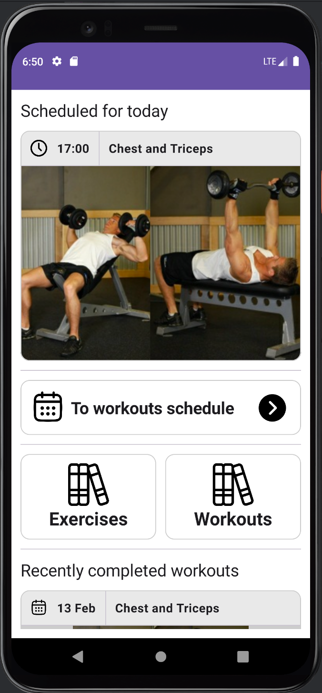
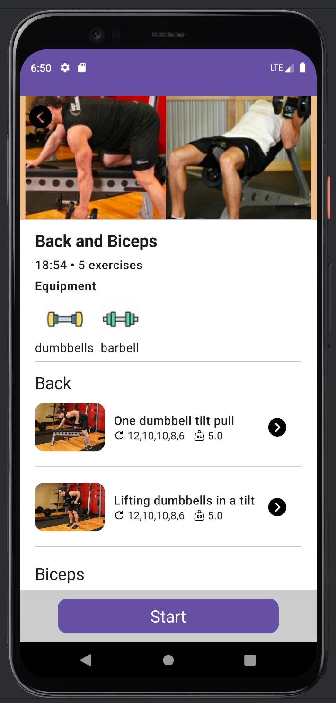
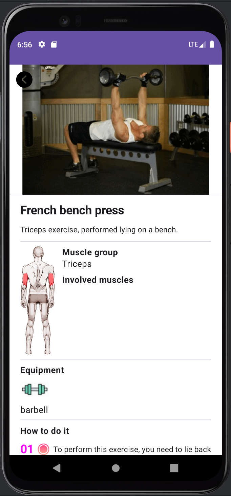
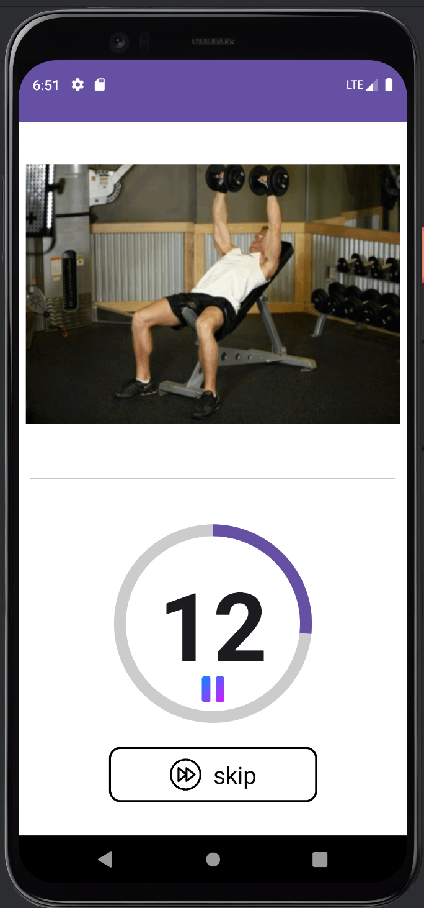

### Fitness Terra

  
  
  
  

## Table Of Contents

* [About the Project](#about-the-project)
* [Built With](#built-with)
* [Getting Started](#getting-started)
* [Usage](#usage)

## About The Project

Fitness Terra is an android app focused on fitness and workout.

## Built With

Kotlin
Android studio
Jetpack compose

## Getting Started

Just open this project at Android studio

## Usage

Hope this app would help me to start perform workouts and exercises daily

